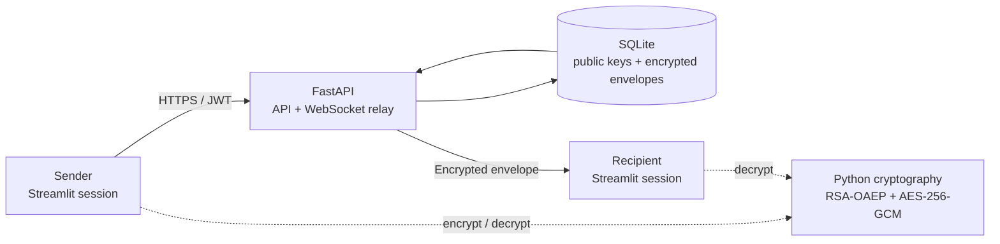
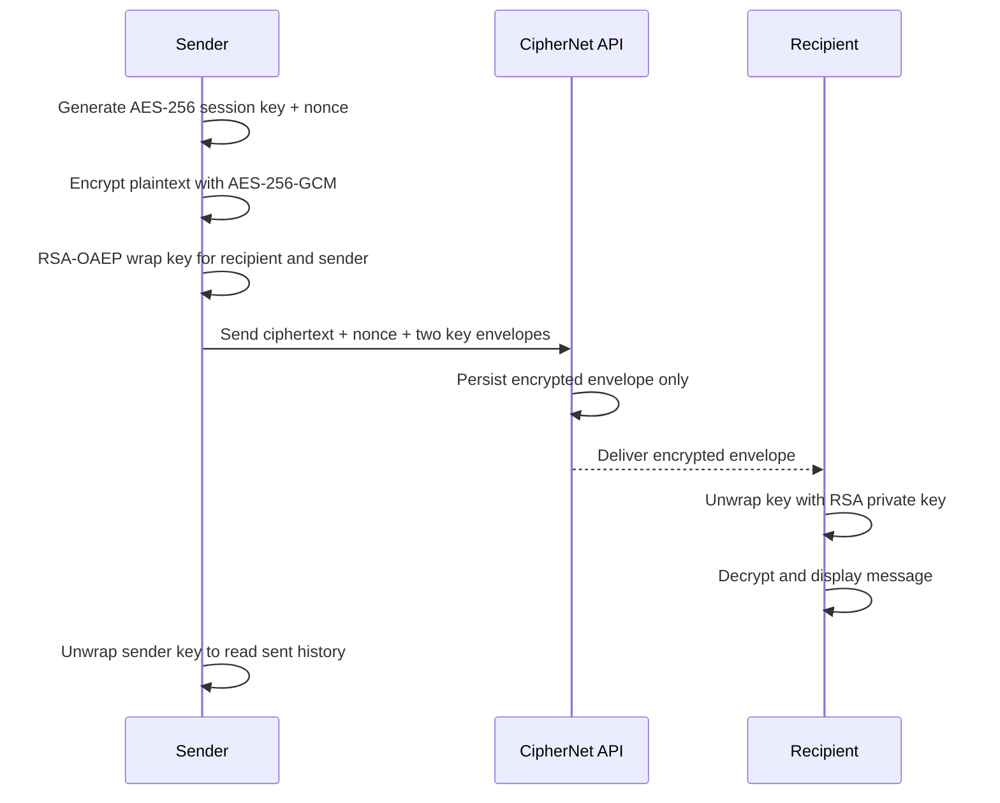

# 🔐 CipherNet 2.0

<p align="center"><b>A Python-first secure-chat demonstration built with FastAPI, Streamlit, SQLite, and modern hybrid cryptography.</b></p>

<p align="center">
  
  
  
  
</p>

---

## What is CipherNet?

CipherNet is a real-time secure-chat demo that replaces the original React, Node.js, Express, Socket.io, and JSON-store stack with a focused Python architecture.

Messages are encrypted before persistence. The server stores encrypted envelopes, public keys, and password-protected private-key recovery envelopes—not readable message text.

## Highlights

| Capability | Implementation |
| --- | --- |
| Secure identity | RSA-2048 key pair created during registration |
| Message encryption | One-time AES-256-GCM session key per message |
| Key exchange | RSA-OAEP with SHA-256 wraps the session key |
| Readable sent history | AES key wrapped separately for sender and recipient |
| Authentication | bcrypt password hashes + signed JWT access tokens |
| Persistence | SQLite database with indexed conversation history |
| Live updates | Open conversations refresh every second |
| API documentation | Interactive OpenAPI documentation at `/docs` |

## Architecture



### Application layout

```text
app/
├── api/routes.py            # Auth, users, history, message and WebSocket routes
├── core/                    # Environment settings and central logging
├── models/schemas.py        # Pydantic request/response contracts
├── services/
│   ├── auth.py              # bcrypt + JWT authentication
│   ├── connections.py       # WebSocket connection manager
│   ├── crypto.py            # RSA, AES-GCM, and key-recovery helpers
│   └── database.py          # SQLite schema and persistence
├── ui/streamlit_app.py      # Streamlit secure-chat interface
└── main.py                  # FastAPI entry point
```

## Encryption workflow



## Message lifecycle

1. Registration generates an RSA key pair. The app sends the public key and a password-encrypted private-key recovery envelope to the API.
2. The sender retrieves the recipient public key, encrypts the message with a fresh AES-256-GCM key, and creates two RSA-OAEP envelopes for that key.
3. FastAPI validates the JWT, stores the encrypted payload in SQLite, and relays the envelope.
4. The recipient chat automatically checks for updates every second, unwraps its key, and displays the plaintext.

## Quick start

### 1. Prepare the environment

```bash
cd /Users/karan/Documents/PROJECTS/ciphernet-python
python -m venv .venv
source .venv/bin/activate
pip install -e '.[dev]'
cp .env.example .env
```

Set a strong, unique `JWT_SECRET` in `.env`. The default SQLite data location is:

```text
~/Library/Application Support/CipherNet/ciphernet.db
```

### 2. Start the API

```bash
uvicorn app.main:app --host 127.0.0.1 --port 8000
```

API docs: [http://127.0.0.1:8000/docs](http://127.0.0.1:8000/docs)

### 3. Start the chat UI

In another terminal, activate the environment and run:

```bash
streamlit run app/ui/streamlit_app.py
```

Open [http://localhost:8501](http://localhost:8501). Create one identity, then create a second identity in a private/incognito browser session to test a conversation.

## API overview

| Method | Endpoint | Purpose |
| --- | --- | --- |
| `POST` | `/auth/register` | Register identity and protected key envelope |
| `POST` | `/auth/login` | Authenticate and receive JWT + recovery envelope |
| `GET` | `/users` | List other chat identities |
| `GET` | `/users/{username}/key` | Fetch a recipient public key |
| `GET` | `/messages/{contact_id}` | Retrieve encrypted conversation history |
| `POST` | `/messages` | Store and relay encrypted message envelope |
| `GET` | `/ws/{token}` | Receive encrypted-envelope events |
| `GET` | `/health` | API health check |

## Test

```bash
pytest
```

The suite checks hybrid encryption for both sender and recipient, password-protected private-key recovery, and registration, login, user discovery, message persistence, and history APIs.

## Security notes

CipherNet is an educational secure-chat project, not a production-certified messaging service. Before production, add TLS termination, strict CORS origins, rate limits, database encryption/backups, audit logging, key rotation, secret management, and an independent security review.

The Streamlit application runs Python on the host serving the UI. Strict browser-to-browser end-to-end encryption needs a separately audited client-side application and device/key verification model.

## Migration

| Original | CipherNet 2.0 |
| --- | --- |
| React + Vite + Tailwind | Streamlit |
| Node.js + Express | FastAPI |
| Socket.io | FastAPI WebSocket endpoint + Streamlit polling |
| JSON persistence | SQLite |
| node-forge AES-CBC/RSA | Python `cryptography` AES-256-GCM/RSA-OAEP |
| bcryptjs + jsonwebtoken | `bcrypt` + PyJWT |

---

Built in Python for a clear, inspectable secure-messaging workflow.
